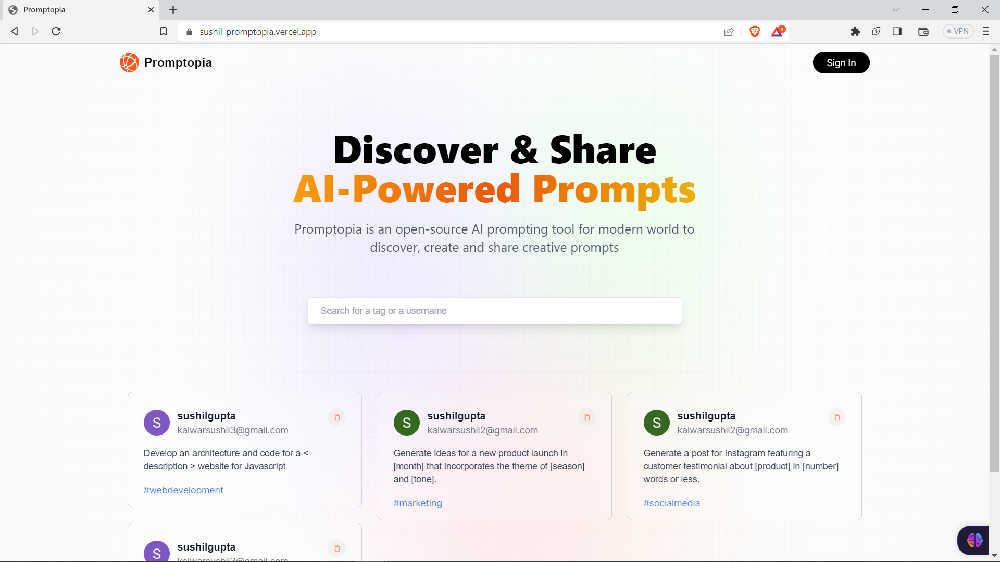
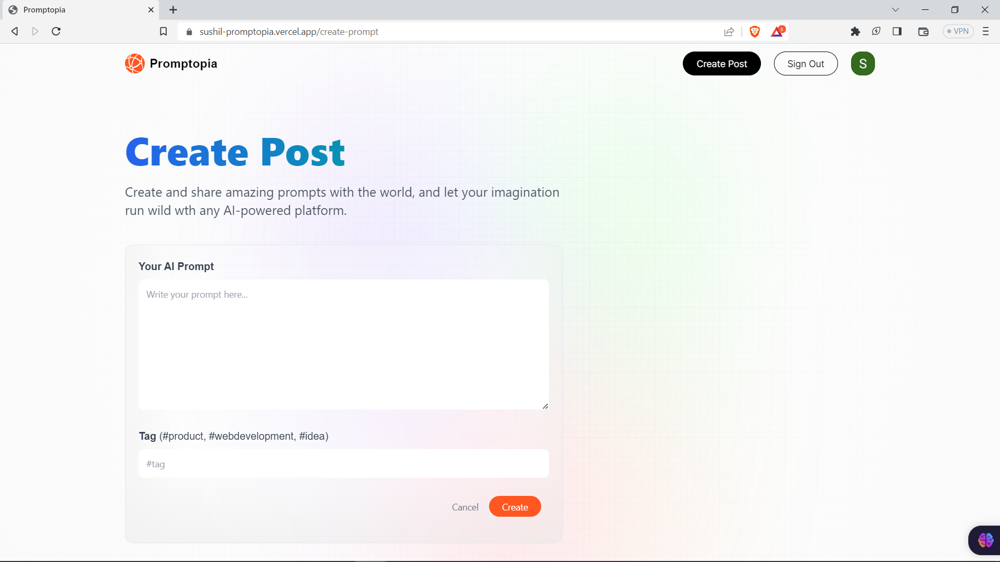

# Full Stack Promptopia with Next.js 13, OAuth2.0, App Router, React, Tailwind, Prisma, mongoose, MongoDB, and NextAuth 2023

#### [https://sushil-promptopia.vercel.app](https://sushil-promptopia.vercel.app)

### Features:

- Create and share AI prompt with tag
- Search prompt with username and prompt tag
- You will be able to log in using Google Authentication!
- Tailwind design
- Tailwind animations and effects
- Full responsiveness
- Page loading state
- Server error handling using react-toast
- Stripe checkout subscription
- NoSQL + mongoose + MongoDB





### Prerequisites

**Node version 14.x**

### Cloning the repository

```shell
git clone https://github.com/iprime2/promptopia-Nextjs-React
```

### Install packages

```shell
npm install
```

### Setup .env file

```
GOOGLE_CLIENT_ID=
GOOGLE_CLIENT_SECRET=
MONGODB_URI=
NEXTAUTH_SECRET=
NEXTAUTH_URL=
NODE_ENV=
```
 
### Setup Prisma

```shell
npx prisma generate
npx prisma db push
```

### Start the app

```shell
npm run dev
```

## Available commands

Running commands with npm `npm run [command]`

| command         | description                              |
| :-------------- | :--------------------------------------- |
| `dev`           | Starts a development instance of the app |
| `lint`          | Check any javascript error               |
| `build`         | To build the webapp                      |
